https://zenn.dev/4kk11/articles/384ce6675f3125
## Requires 
https://civitai.com/models/126660/architectureexteriorsdlifechiasedammev60   
https://civitai.com/models/68286?modelVersionId=72978   
https://civitai.com/models/4201?modelVersionId=130072

## Original
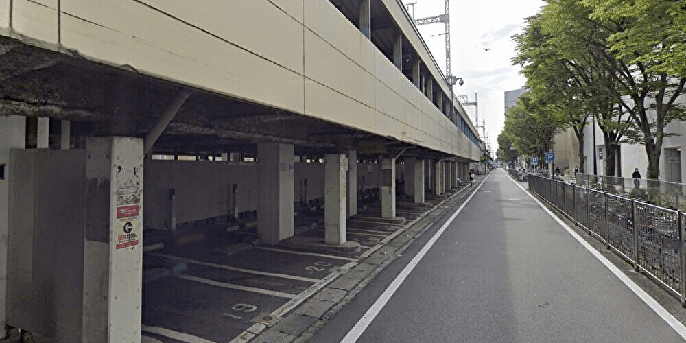

## ControlNet
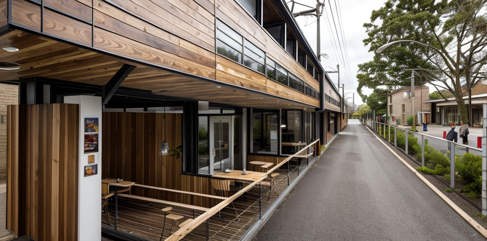

## ControlNet + LoRA
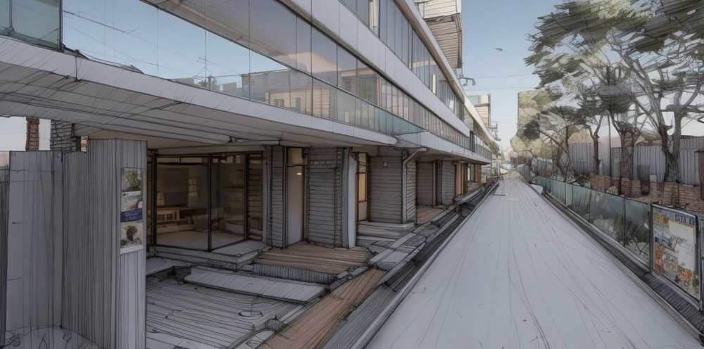

## ControlNet + LoRA + Inpainting
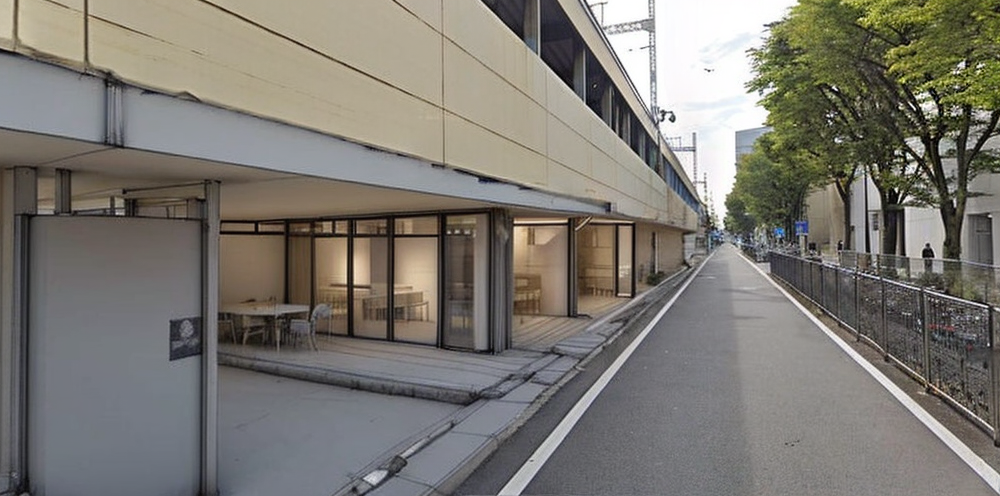
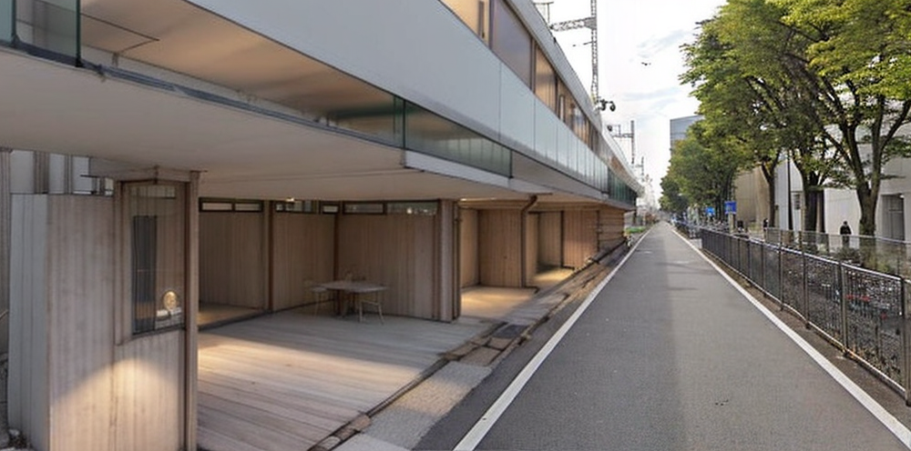
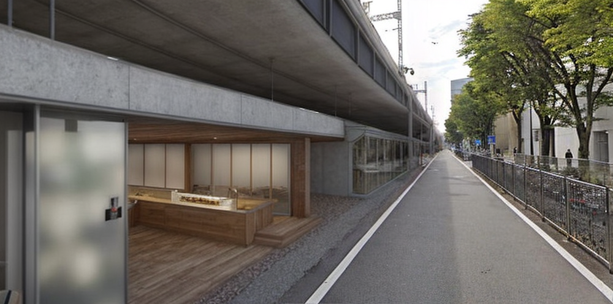

# Extra(Cube)
ControlNetの検証（Seed値は固定）
## Original
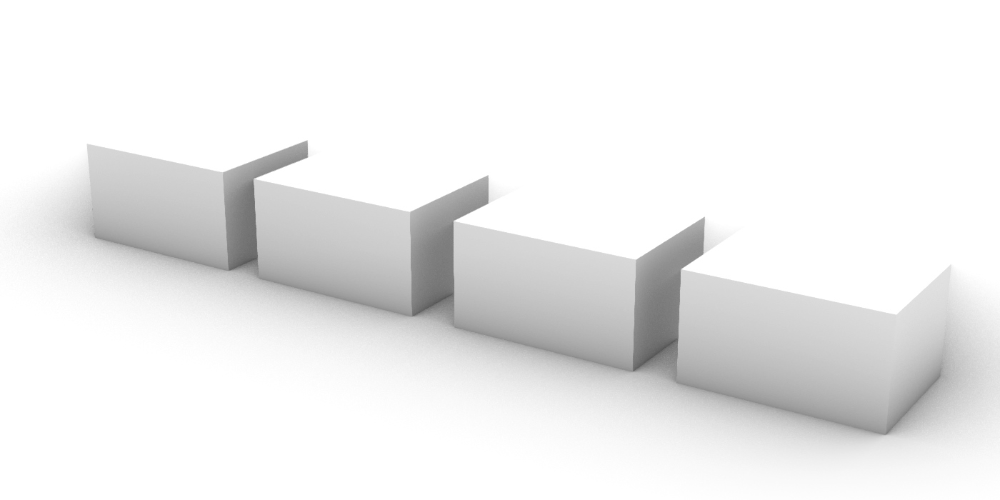
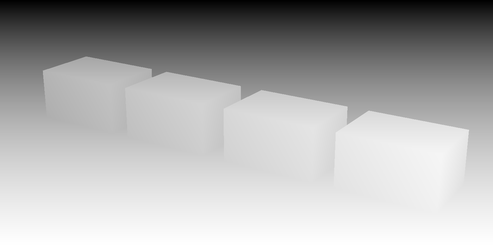
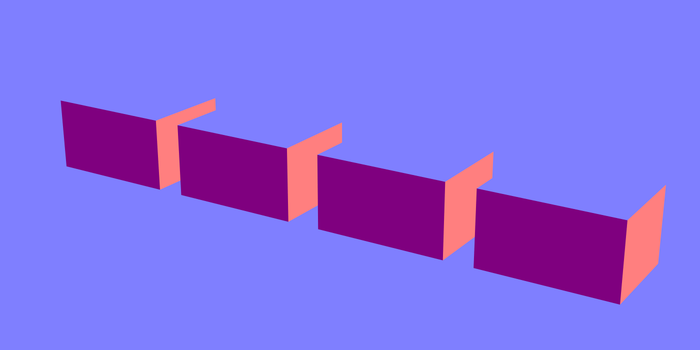

## depth
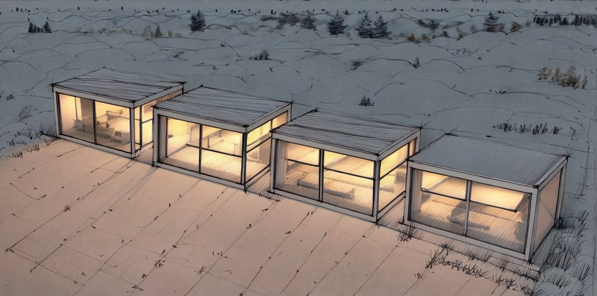
## lineart
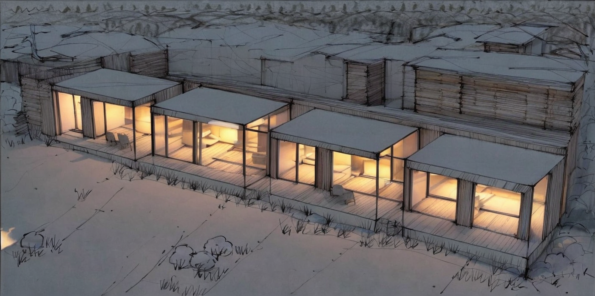
## scribble
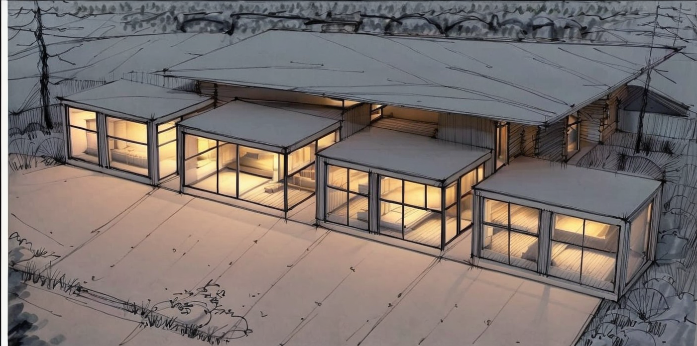
## depth + lineart
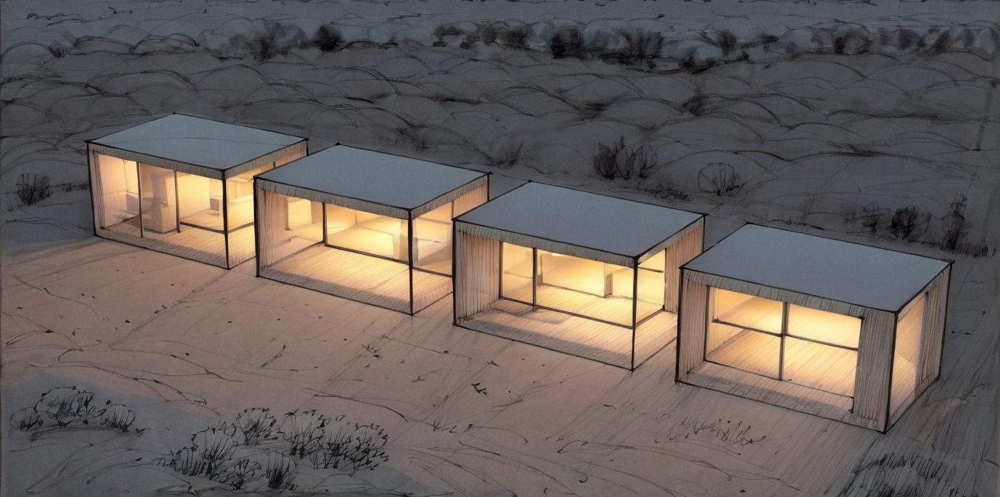
## depth+ scribble
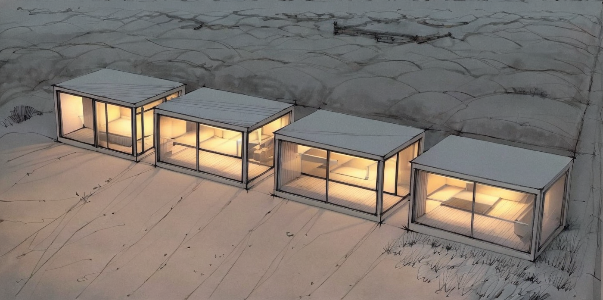
## upscale
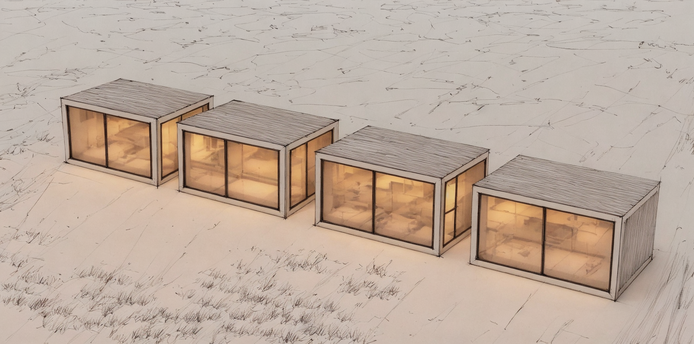
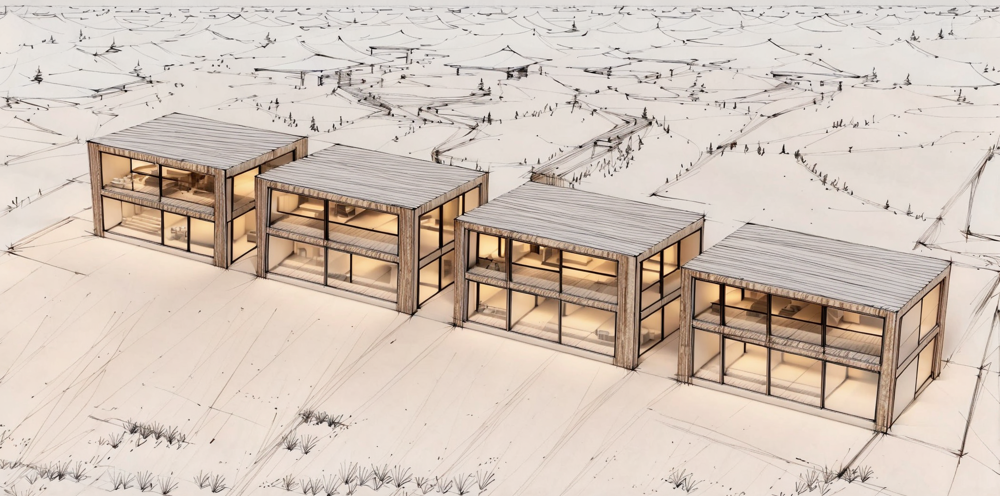
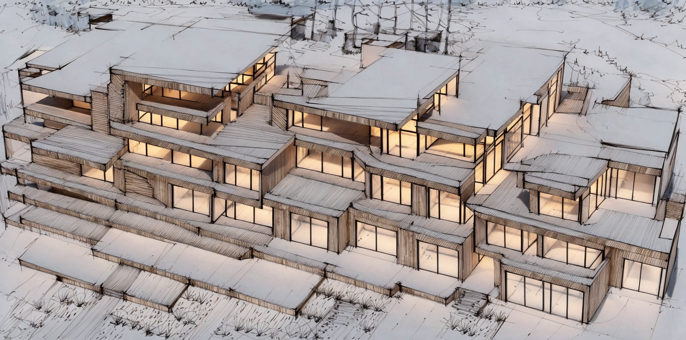

