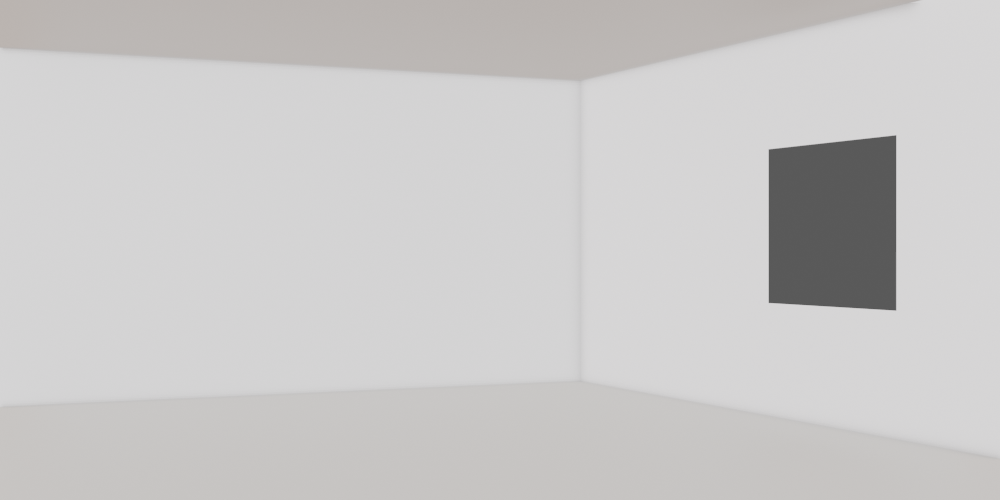
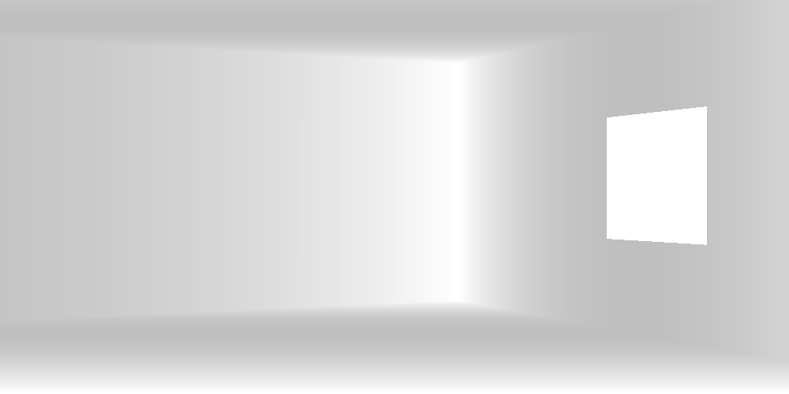
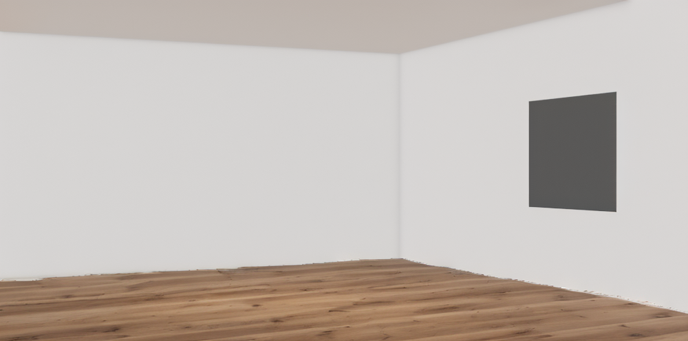
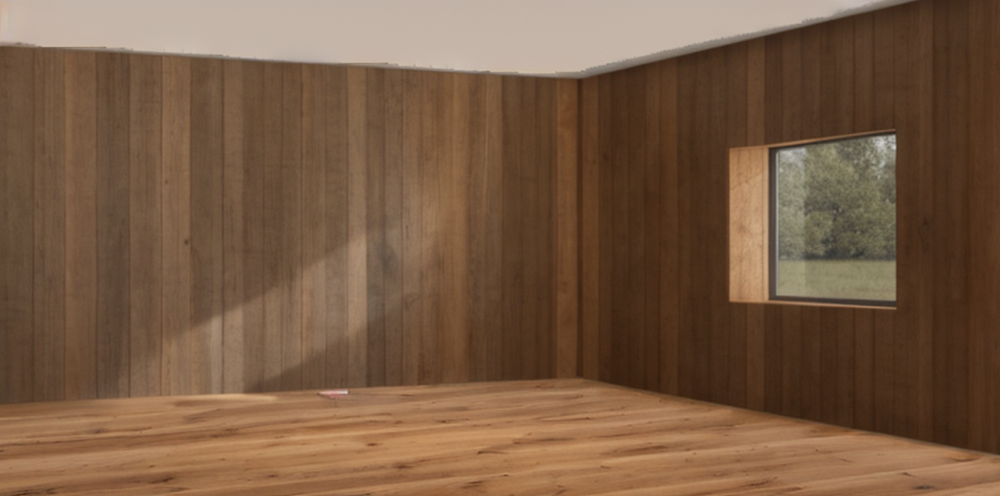
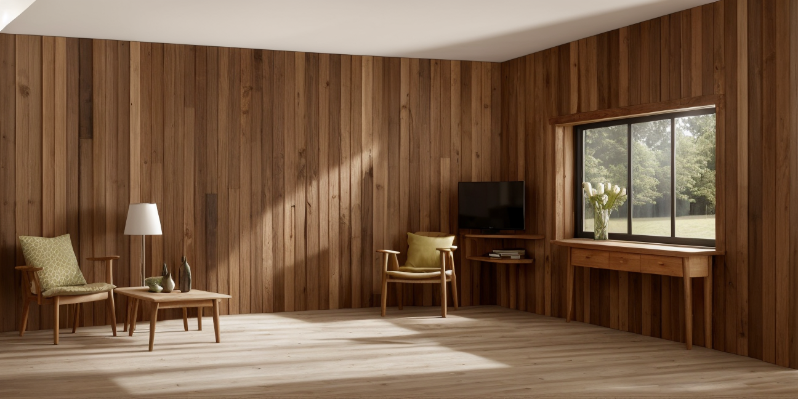
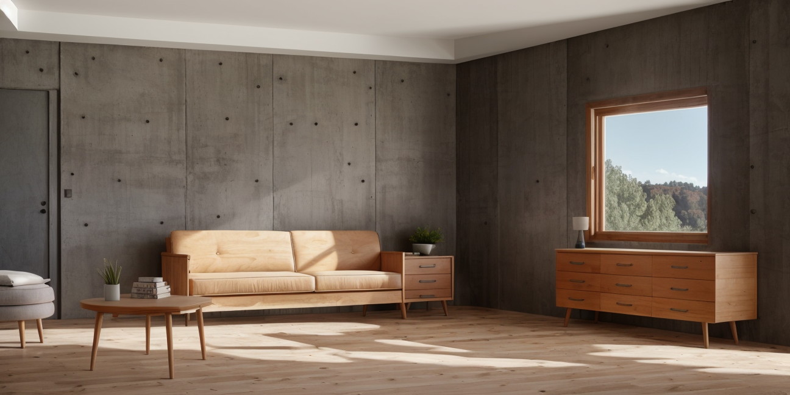

https://zenn.dev/4kk11/articles/384ce6675f3125
## Requires 
https://civitai.com/models/126660/architectureexteriorsdlifechiasedammev60   
https://civitai.com/models/68286?modelVersionId=72978   
https://civitai.com/models/4201?modelVersionId=130072

## Original

## ControlNet

## ControlNet + LoRA

## ControlNet + LoRA + Inpainting

# Extra(Cube)
ControlNetの検証（Seed値は固定）
## Original

## depth

## lineart

## scribble

## depth + lineart

## depth+ scribble

## upscale

# Extra(Interior)
Inpaintでフローリング→壁の順で生成し、最後にupscaleで仕上げる
## Original

## Floor

## Wall

## Finish(upscale)

